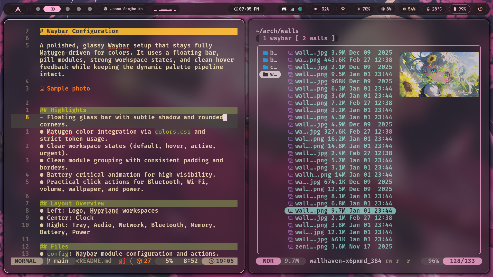

# Waybar Configuration

A polished, glassy Waybar setup that stays fully Matugen-driven for colors. It uses a floating bar, pill modules, strong workspace states, and clean hover feedback while keeping the dynamic palette pipeline intact.



## Highlights

- **Floating Glass Bar**: Translucent background with a clean border and rounded corners.
- **Matugen Integration**: Full palette synchronization via `colors.css`.
- **Dynamic Battery Tile**: Colorful states (Good, Warning, Critical) with charging glow and detailed tooltips.
- **Powerful Scripts**: Custom Rofi-based managers for Wi-Fi, Bluetooth, and Wallpapers.
- **Interactive Feedback**: Smooth transitions, pulsing animations, and hover effects on all modules.

## Layout Overview

- **Left**: Logo (Theme Switcher), Hyprland Workspaces, MPRIS Media, Cava Visualizer.
- **Center**: Clock (with Calendar tooltip).
- **Right**: Tray, Audio, Network, Bluetooth, CPU, Memory, Temperature, Battery, Power.

## Files

- `config`: Main configuration, module definitions, and click actions.
- `style.css`: Visual styling, glass effects, animations, and state overrides.
- `colors.css`: Matugen-generated palette tokens (Imported by `style.css`).
- `Scripts/`:
  - `wifi.sh`: Advanced Wi-Fi manager with signal strength and manual entry.
  - `bluetooth.sh`: Bluetooth device manager with scanning and easy pairing.
  - `theme-change.sh`: Random wallpaper switcher with Matugen regeneration.
  - `wallpaper_select.sh`: Rofi-based wallpaper picker with image previews.
  - `cava.sh`: Script for the Cava audio visualizer.

## Modules and Behavior

### `battery`
- **Visuals**: Dynamic colors based on capacity (Primary for Good, Secondary for Warning, Error for Critical).
- **Animations**: Subtle pulse glow when charging; high-visibility blink when critical.
- **Tooltip**: Shows estimated time remaining (`{timeTo}`) and percentage.
- **States**: Good (>=95%), Warning (<=30%), Critical (<=15%).

### `network` (`wifi.sh`)
- **Menu**: Clean Rofi interface showing SSID, Signal Strength, and Security type.
- **Features**: Disconnect option, Manual SSID entry, and automatic password prompts.
- **Status**: Active connection marked with a checkmark (`󰄬`).

### `bluetooth` (`bluetooth.sh`)
- **Menu**: Lists paired devices with connection status icons.
- **Scanning**: Dedicated "Scan for Devices" option with 10-second background discovery.
- **Pairing**: Streamlined "Pair, Trust, & Connect" flow for new devices.

### `custom/logo` & Wallpapers
- **Left Click**: Triggers `theme-change.sh` for a random wallpaper and fresh Matugen palette.
- **Right Click**: Triggers `wallpaper_select.sh` for a visual Rofi grid (4 columns) with image thumbnails.
- **Transitions**: Smooth `swww` transitions (grow from top-right) for all wallpaper changes.

## Visual System Notes

- **Pill Modules**: Each module is encapsulated in a "pill" with `@surface_container` background.
- **Hover Glow**: Active modules show a subtle glow effect (`box-shadow`) matching the `@primary` color.
- **Glass Effect**: The main bar uses `alpha(@background, 0.7)` for a modern translucent look.

## Dependencies

Required for full functionality:

- **Core**: `waybar`, `hyprland`, `matugen`, `swww`, `rofi`.
- **Networking**: `nmcli` (NetworkManager).
- **Bluetooth**: `bluetoothctl`, `rfkill`.
- **Audio/System**: `wireplumber` (wpctl), `brightnessctl`, `wlogout`.
- **Fonts**: `JetBrainsMono Nerd Font` (or any Nerd Font with glyphs).

## Usage

- **Start Waybar**:
  ```sh
  waybar
  ```
- **Reload Configuration**:
  ```sh
  pkill waybar && waybar &
  ```

## Troubleshooting

- **Rofi Errors**: If menus fail to open, ensure `rofi` version is 1.7+ (supports `-theme-str`).
- **Permissions**: Ensure all scripts in `Scripts/` are executable:
  ```sh
  chmod +x ~/.config/waybar/Scripts/*.sh
  ```
- **Wallpaper Issues**: If `swww` fails, the scripts will attempt to start `swww-daemon` automatically. Ensure `swww` is installed.
- **Empty Menus**: If Bluetooth/Wi-Fi menus are empty, verify the hardware is enabled (`rfkill list`).

## Credits

- **Waybar**: The flexible bar framework.
- **Matugen**: Dynamic Material Design 3 color palettes.
- **swww**: Efficient wallpaper transitions.
